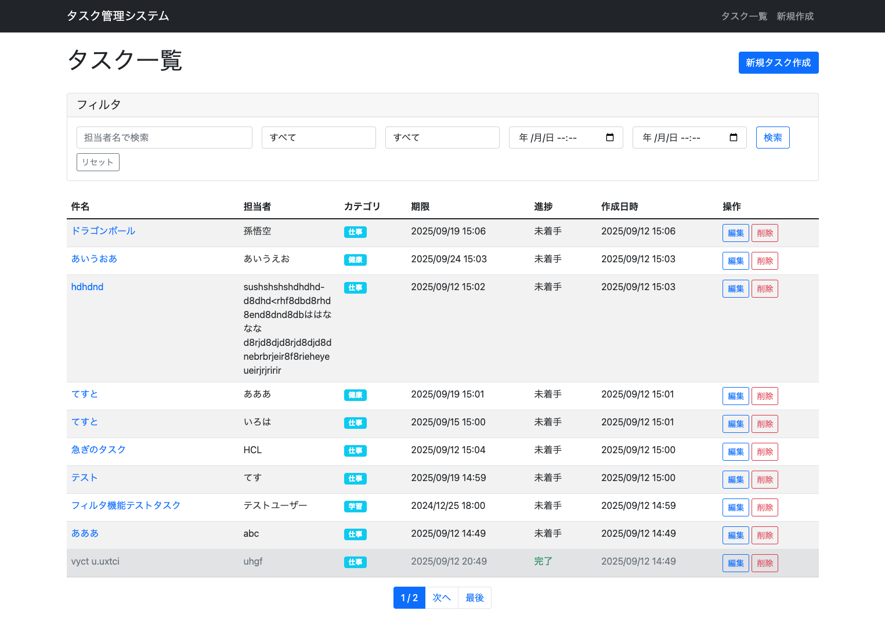
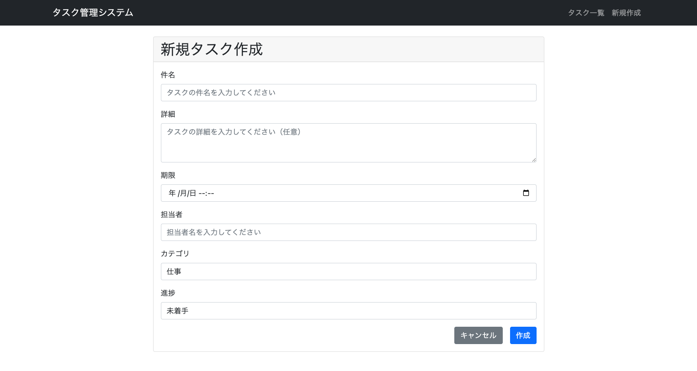
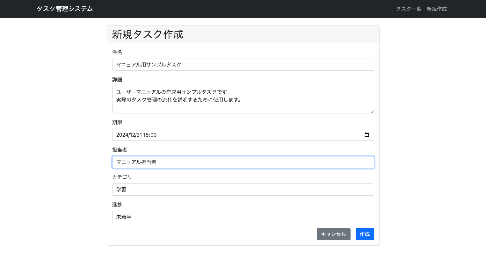
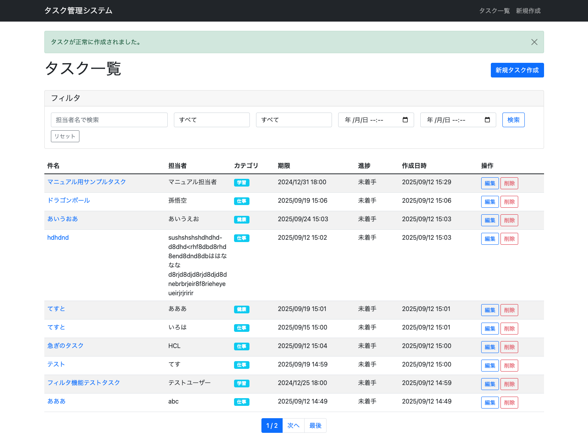
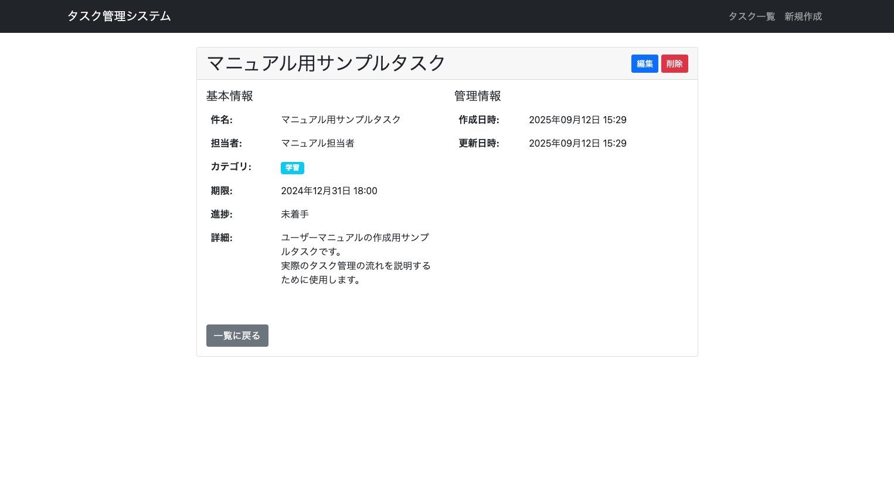
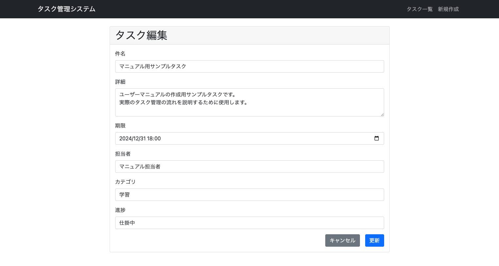
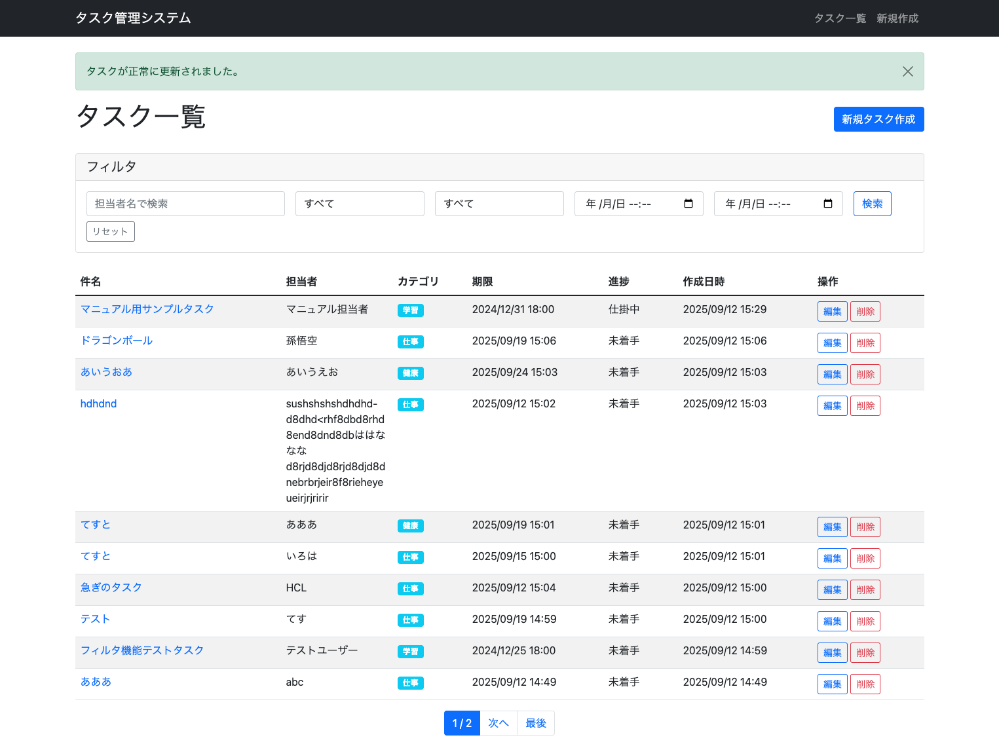
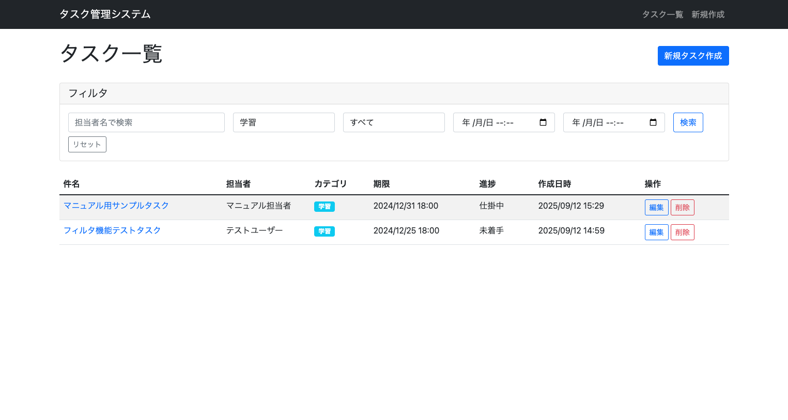

# タスク管理システム ユーザーマニュアル

## 目次
1. [システム概要](#システム概要)
2. [基本的なタスク管理の流れ](#基本的なタスク管理の流れ)
3. [フィルタ機能の活用](#フィルタ機能の活用)
4. [よくある質問](#よくある質問)

---

## システム概要

タスク管理システムは、個人やチームでのタスク管理を効率化するためのWebアプリケーションです。

### 主な特徴
- **シンプルな操作**: 直感的なインターフェースで誰でも簡単に使用可能
- **豊富なフィルタ機能**: 担当者、カテゴリ、期限、進捗でタスクを絞り込み
- **視覚的な進捗管理**: 完了タスクのグレーアウト表示で進捗が一目瞭然
- **レスポンシブデザイン**: PC、タブレット、スマートフォンで快適に利用可能

---

## 基本的なタスク管理の流れ

### シナリオ: 新しいタスクを作成して管理する

#### 1. タスクの作成

**「新規タスク作成」ボタンをクリックしてタスク作成画面に移動します。**

**必要事項を入力します：**
- **件名**: タスクのタイトル（必須）
- **詳細**: タスクの詳細説明（任意）
- **期限**: 完了期限を日時で設定（必須）
- **担当者**: 担当者名を入力（必須）
- **カテゴリ**: プルダウンから選択（必須）
- **進捗**: 初期状態は「未着手」

**「作成」ボタンをクリックしてタスクを作成します。**

#### 2. タスクの詳細確認

**作成したタスクの件名をクリックして詳細画面を表示します。**

詳細画面では以下の情報を確認できます：
- 基本情報（件名、担当者、カテゴリ、期限、進捗、詳細）
- 管理情報（作成日時、更新日時）

#### 3. 進捗の更新

**「編集」ボタンをクリックして編集画面に移動します。**

**進捗を「仕掛中」に変更して「更新」ボタンをクリックします。**

進捗が更新され、一覧画面で黄色の「仕掛中」表示が確認できます。

---

## フィルタ機能の活用

### シナリオ: 特定のカテゴリのタスクのみを表示する

**カテゴリフィルタで「学習」を選択して「検索」ボタンをクリックします。**

学習カテゴリのタスクのみが表示され、効率的にタスクを管理できます。

### フィルタ機能の種類

1. **担当者フィルタ**: 担当者名での部分一致検索
2. **カテゴリフィルタ**: カテゴリでの完全一致検索
3. **進捗フィルタ**: 進捗状況での完全一致検索
4. **期限フィルタ**: 期限の範囲指定検索

### フィルタの組み合わせ
複数のフィルタ条件を同時に設定することで、より詳細な絞り込みが可能です。

---

## よくある質問

### Q1: タスクの件名が長すぎて見切れてしまいます
**A**: システムでは長い件名は自動的に折り返されて表示されます。また、タスク詳細画面でも適切に表示されるようになっています。

### Q2: 期限が過ぎたタスクを確認したい
**A**: 期限フィルタを使用して、過去の日時を設定することで期限切れのタスクを確認できます。

### Q3: 完了したタスクを非表示にしたい
**A**: 進捗フィルタで「未着手」または「仕掛中」を選択することで、完了したタスクを非表示にできます。

### Q4: 同じ担当者のタスクをまとめて確認したい
**A**: 担当者フィルタに担当者名を入力することで、その担当者のタスクのみを表示できます。

### Q5: タスクを削除してしまいました。復元できますか？
**A**: 申し訳ございませんが、削除したタスクは復元できません。削除前には必ず内容を確認してください。

### Q6: カテゴリを追加したい
**A**: 現在のシステムでは、カテゴリの追加はできません。既存のカテゴリ（仕事、個人、学習、健康、財務、その他）から選択してください。

### Q7: 複数の担当者を設定できますか？
**A**: 現在のシステムでは、1つのタスクに1人の担当者のみ設定可能です。複数人で作業する場合は、担当者名に「田中・佐藤」のように記載することをお勧めします。

### Q8: タスクの優先度を設定できますか？
**A**: 現在のシステムでは優先度機能はありませんが、期限やカテゴリを活用してタスクの管理を行ってください。

---

## サポート

システムの使用方法についてご不明な点がございましたら、システム管理者までお問い合わせください。

---

**タスク管理システム v1.0**  
最終更新日: 2025年9月12日
